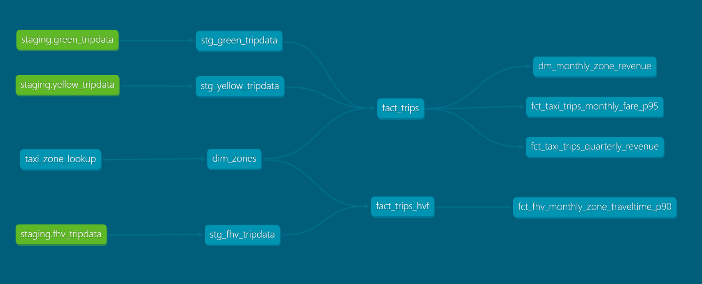

# NYC Taxi Data Engineering Pipeline 🚖

This project showcases an end-to-end Data Engineering workflow using modern tools and cloud infrastructure. The pipeline ingests NYC Taxi trip data, applies initial transformations in Kestra, orchestrates processing, and performs advanced analytics transformations with dbt—demonstrating production-grade data engineering practices.

---

## 🏗️ Architecture Overview

```
NYC Open Data → Kestra (Download + Transform) → GCP Storage → BigQuery → dbt → Analytics
```

The pipeline follows a modern ELT approach with preprocessing:
1. **Extract & Transform**: Download NYC Taxi data + apply initial data cleaning in Kestra
2. **Load**: Store processed data in GCP Storage → BigQuery
3. **Transform**: Apply advanced business logic and create analytics-ready tables with dbt

---

## 🔧 Tech Stack

* **Kestra** – Workflow orchestration, scheduling & initial data transformations
* **Google Cloud Platform** – BigQuery (warehouse), Cloud Storage (data lake)
* **Terraform** – Infrastructure as Code (IaC)
* **dbt** – Advanced data transformation & modeling
* **Docker** – Containerized services
* **PostgreSQL** – Kestra metadata backend
* **Python & SQL** – Core scripting & transformations

---

## 📊 Data Source

**NYC Taxi & Limousine Commission Trip Records**
- **Yellow Taxi**: Traditional street-hail taxis
- **Green Taxi**: Boro taxis (outer boroughs)
- **Format**: Parquet files, monthly partitions
- **Volume**: ~2-3M records per month per taxi type
- **Source**: [NYC Open Data Portal](https://www.nyc.gov/site/tlc/about/tlc-trip-record-data.page)

---

## 🎯 Project Objectives

✅ **Automated Data Ingestion**: Scheduled downloads from public APIs  
✅ **Multi-Stage Transformations**: Initial cleaning in Kestra + advanced modeling in dbt  
✅ **Cloud-Native Architecture**: Scalable GCP-based infrastructure  
✅ **Infrastructure as Code**: Reproducible Terraform deployments  
✅ **Data Quality**: Testing and validation at each stage  
✅ **Analytics Ready**: Dimensional modeling with fact/dimension tables  

---

## 🔄 Pipeline Workflow

### Stage 1: Ingestion & Initial Transformation (`1_ingesting_into_gcp.yaml`)
- Downloads monthly Parquet files from NYC Open Data
- **Applies initial transformations**:
  - Data type standardization
  - Basic data cleaning and validation
  - Column renaming for consistency
  - Null value handling
- Uploads processed data to GCP Cloud Storage buckets
- Handles both Yellow and Green taxi data

### Stage 2: Raw Loading (`2_create_native_subtables.yaml`)
- Creates BigQuery external tables from processed GCS files
- Maintains monthly partitions as separate subtables
- Preserves cleaned data structure from Stage 1

### Stage 3: Consolidation (`3_merge_tables.yaml`)
- Merges monthly subtables into cumulative tables
- Optimizes storage and query performance
- Cleans up temporary subtables

### Stage 4: Advanced Transformation (dbt)
- Creates staging models with additional data cleaning
- Builds dimensional models (facts & dimensions)
- Applies complex business logic and aggregations
- Generates data quality tests and documentation

---

## 🚀 Quick Start Guide

### Prerequisites

- **GCP Account** with billing enabled
- **Terraform** (≥ 1.0)
- **Docker & Docker Compose**
- **Python** (≥ 3.8)
- **Git**

### 1. Clone & Setup

```bash
git clone https://github.com/omarkhaled122/nyc-taxi-data-engineering-pipeline.git
cd nyc-taxi-data-engineering-pipeline
```

### 2. GCP Configuration

#### Create GCP Resources:
1. Create a new GCP project
2. Enable APIs: BigQuery, Cloud Storage, Cloud Resource Manager
3. Create a service account with these roles:
   - `BigQuery Admin`
   - `Storage Admin`
   - `Storage Object Admin`
4. Download the service account JSON key

#### Update Terraform Variables:
Edit `terraform/variables.tf`:

```hcl
variable "credentials" {
  description = "Path to the GCP service account JSON file"
  default     = "./keys/your-service-account-key.json"  # Update this path
}

variable "project" {
  description = "Your GCP Project ID"
  default     = "your-gcp-project-id"  # Update this
}
```

#### Deploy Infrastructure:
```bash
cd terraform/
terraform init
terraform plan    # Review planned changes
terraform apply   # Deploy resources
```

**Created Resources:**
- BigQuery dataset: `nyc_taxi_data`
- GCS bucket: `nyc-taxi-{project-id}`
- IAM roles and permissions

### 3. Launch Kestra

```bash
cd kestra/
docker-compose up -d
```

**Services Started:**
- Kestra UI: http://localhost:8080
- PostgreSQL backend (internal)

### 4. Configure Kestra Workflows

#### Import Flows:
1. Open http://localhost:8080
2. Navigate: **Flows** → **Create Flow** → **Import**
3. Import all 3 flows from `kestra/flows/`

#### Set Configuration Variables:
Navigate: **Settings** → **Configuration** → **Variables (KV)**

> **⚠️ Important**: Select `zoomcamp` as the namespace

| Key | Value | Description |
|-----|-------|-------------|
| `GCP_CREDS` | Base64-encoded JSON key | Your service account credentials |
| `GCP_PROJECT_ID` | your-project-id | GCP project identifier |
| `GCP_LOCATION` | US | BigQuery dataset region |
| `GCP_BUCKET_NAME` | your-bucket-name | Created by Terraform |
| `GCP_DATASET` | nyc_taxi_data | BigQuery dataset name |

**To encode your GCP credentials:**
```bash
# Linux/Mac
base64 -i path/to/your-key.json

# Windows
certutil -encode path\to\your-key.json encoded.txt
```

### 5. Execute Data Pipeline

#### Step 1: Data Ingestion & Initial Transformation
1. Open flow: `1_ingesting_into_gcp.yaml`
2. Go to **Triggers** → **Backfill executions**
3. Set date range (e.g., 2024-01-01 to 2024-03-01)
4. Input: `taxi_type` = `green` or `yellow`
5. Click **Launch**

**What happens in this step:**
- Downloads raw Parquet files from NYC Open Data
- **Applies transformations in Kestra**:
  - Standardizes column names and data types
  - Handles missing values and invalid records
  - Applies basic business rules
  - Formats data for BigQuery compatibility
- Uploads cleaned/transformed files to GCS bucket

**Result**: Processed and cleaned Parquet files in GCS bucket

#### Step 2: Create Raw Tables
1. Open flow: `2_create_native_subtables.yaml`
2. Use same date range as Step 1
3. Input: Same `taxi_type`
4. Execute

**Result**: Monthly tables created in BigQuery (e.g., `green_tripdata_2024-01`) with cleaned data from Kestra transformations

#### Step 3: Merge Tables
1. Open flow: `3_merge_tables.yaml`
2. Input: Same `taxi_type`
3. Execute once (no date range needed)

**Result**: Consolidated table (e.g., `green_tripdata`) with all monthly cleaned data

### 6. dbt Advanced Transformations

#### Install dbt:
```bash
pip install dbt-core dbt-bigquery
```

#### Configure Profile:
Create `~/.dbt/profiles.yml`:

```yaml
nyc_taxi_pipeline:
  target: dev
  outputs:
    dev:
      type: bigquery
      method: service-account
      project: your-gcp-project-id          # Update this
      dataset: nyc_taxi_analytics           # dbt target dataset
      keyfile: /path/to/service-account.json # Update this
      threads: 4
      timeout_seconds: 300
      location: US
```

#### Run dbt Pipeline:
```bash
cd dbt/
dbt deps          # Install dependencies
dbt seed          # Load lookup tables
dbt run           # Execute advanced transformations
dbt test          # Run data quality tests
dbt docs generate # Build documentation
dbt docs serve    # Launch docs site
```

**Result**: Advanced analytical datasets with dimensional modeling applied to the already-cleaned data from Kestra

---

## 🔄 Transformation Layers

### Layer 1: Kestra Transformations (Initial Processing)
**Purpose**: Data ingestion preprocessing and basic cleaning
- **Column standardization**: Consistent naming conventions
- **Data type conversion**: Proper BigQuery-compatible types  
- **Basic validation**: Remove obviously invalid records
- **Null handling**: Strategic null value management
- **Format standardization**: Consistent date/time formats

### Layer 2: dbt Transformations (Advanced Analytics)
**Purpose**: Business logic and analytical modeling
- **Advanced cleaning**: Complex business rules
- **Feature engineering**: Calculated fields and metrics
- **Dimensional modeling**: Facts and dimensions separation
- **Aggregations**: Summary tables and KPIs
- **Data quality testing**: Comprehensive validation

---

## 📈 Expected Outcomes

### Data Volumes (per month)
- **Yellow Taxi**: ~2.5M trips
- **Green Taxi**: ~200K trips

### Data Flow & Quality
```
Raw NYC Data (Parquet)
    ↓ (Kestra: Basic cleaning)
Cleaned Data in GCS
    ↓ (BigQuery: Storage)
Monthly Tables
    ↓ (Merge: Consolidation)  
Consolidated Tables
    ↓ (dbt: Advanced transformations)
Analytics-Ready Datasets
```

### BigQuery Tables Structure
```
nyc_taxi_data/
├── green_tripdata          # Kestra-processed consolidated
├── yellow_tripdata         # Kestra-processed consolidated
└── dbt models/
    ├── staging/
    │   ├── stg_green_tripdata    # dbt additional cleaning
    │   └── stg_yellow_tripdata   # dbt additional cleaning
    ├── intermediate/
    │   └── int_trips_with_features
    └── marts/
        ├── fact_trips
        ├── dim_locations
        └── dim_payment_types
```

---

## 🧪 Data Quality & Testing

### Kestra-Level Quality
- **File validation**: Verify download completeness
- **Schema validation**: Ensure expected columns exist
- **Basic range checks**: Obvious data anomalies
- **Upload verification**: Confirm GCS upload success

### dbt-Level Testing
- **Uniqueness**: Primary key constraints
- **Referential Integrity**: Foreign key relationships  
- **Data Range**: Fare amounts, trip distances
- **Completeness**: Required field validation
- **Business Rules**: Complex validation logic

### Monitoring
- Pipeline execution logs in Kestra UI
- BigQuery query performance metrics
- dbt test results and documentation

---

## 🔍 dbt Lineage & Documentation

### Model Lineage Graph


### Key Transformations by Layer

#### Kestra Transformations
- **Column Mapping**: Standardize field names across taxi types
- **Data Type Fixes**: Convert strings to proper numeric/date types
- **Invalid Record Removal**: Filter out corrupted or test data
- **Basic Standardization**: Consistent formatting

#### dbt Transformations  
- **Advanced Data Cleaning**: Complex business rule validation
- **Feature Engineering**: Trip duration, distance categories, time-based features
- **Dimensional Modeling**: Separate facts from dimensions
- **Aggregations**: Monthly summaries, location statistics
- **Performance Optimization**: Partitioning and clustering

---

## 🐛 Troubleshooting

### Common Issues

**Kestra Variables Not Found**
- Ensure namespace is set to `zoomcamp`
- Verify base64 encoding of GCP credentials

**Kestra Transformation Failures**
- Check input data format matches expected schema
- Verify transformation logic in flow YAML
- Review Kestra execution logs for specific errors

**BigQuery Permission Errors**
- Check service account has required roles
- Verify project ID matches across configurations

**Terraform Apply Fails**
- Ensure GCP billing is enabled
- Check API quotas and limits

**dbt Connection Issues**
- Verify profiles.yml path and syntax
- Test BigQuery connection independently

---

## 🛠️ Development & Customization

### Adding New Transformations

#### In Kestra:
1. Modify transformation logic in flow YAML files
2. Add new SQL/Python tasks for processing
3. Test with small data samples first
4. Update documentation

#### In dbt:
1. Add models in `dbt/models/`
2. Define tests in `schema.yml`
3. Update `dbt_project.yml` if needed
4. Run `dbt run` and `dbt test`

### Adding New Data Sources
1. Create new Kestra flow in `kestra/flows/`
2. Implement appropriate transformations
3. Update BigQuery schema if needed
4. Add corresponding dbt models
5. Update documentation

---

## 🚀 Future Enhancements

- [ ] **Real-time Streaming**: Kafka/Pub-Sub integration with stream processing
- [ ] **Apache Airflow**: Alternative orchestrator comparison
- [ ] **Advanced Transformations**: Machine learning feature engineering in Kestra
- [ ] **Data Catalog**: Apache Atlas or Google Data Catalog integration
- [ ] **Visualization**: Looker Studio or Metabase dashboards
- [ ] **MLOps**: Feature store for ML model training
- [ ] **Cost Optimization**: Advanced BigQuery clustering and partitioning
- [ ] **CI/CD**: GitHub Actions for both Kestra flows and dbt deployments

---

## 👨‍💻 Author

**Omar Khaled Elshiekh**  
Data Engineer | Analytics Enthusiast

[](https://www.linkedin.com/in/omarkhaled122/)
[](https://github.com/omarkhaled122)

---

## 📄 License

This project is licensed under the MIT License - see the [LICENSE](LICENSE) file for details.

---

## 🙏 Acknowledgments

- NYC Taxi & Limousine Commission for open data
- Kestra community for orchestration and transformation tools
- dbt Labs for advanced transformation framework
- Google Cloud Platform for scalable infrastructure

---

*Built with ❤️ for the data engineering community*